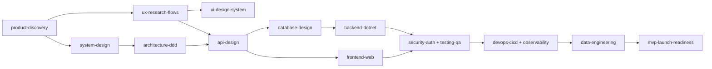

# MVP Fullstack Skills

Bộ **Agent Skills** cho Claude Code giúp một software developer đi từ **ý tưởng → MVP production** theo quy trình có cổng chất lượng (gate) ở mỗi phase. Stack mặc định: **.NET 8/9 + ASP.NET Core, DDD, Clean Architecture, Modular Monolith**, frontend React/Next.js (hoặc Blazor), PostgreSQL, Docker.

## Danh sách skill

| # | Skill | Vai trò |
|---|---|---|
| 0 | [`mvp-orchestrator`](skills/mvp-orchestrator) | Điều phối pipeline, chọn skill đúng phase, kiểm gate |
| 1 | [`product-discovery`](skills/product-discovery) | Problem, persona, scope MVP, user story, metric |
| 2 | [`ux-research-flows`](skills/ux-research-flows) | Journey, user flow, IA, wireframe, a11y |
| 3 | [`ui-design-system`](skills/ui-design-system) | Design tokens, component, responsive, hand-off |
| 4 | [`system-design`](skills/system-design) | NFR, capacity, C4, chọn hạ tầng, failure modes |
| 5 | [`architecture-ddd`](skills/architecture-ddd) | DDD, Clean/Onion, Modular Monolith vs Microservices, ADR |
| 6 | [`api-design`](skills/api-design) | REST/GraphQL/gRPC, OpenAPI contract-first |
| 7 | [`database-design`](skills/database-design) | ERD, index, EF Core/Dapper, migration, backup |
| 8 | [`backend-dotnet`](skills/backend-dotnet) | CQRS, MediatR, FluentValidation, Outbox, Redis, RabbitMQ |
| 9 | [`frontend-web`](skills/frontend-web) | React/Next.js, TanStack Query, form, perf, E2E |
| 10 | [`security-auth`](skills/security-auth) | STRIDE, OIDC, RBAC/policy, OWASP, secret |
| 11 | [`testing-qa`](skills/testing-qa) | Pyramid, Testcontainers, architecture test, k6 |
| 12 | [`devops-cicd`](skills/devops-cicd) | Docker, GitHub Actions, IaC, K8s/PaaS, rollback |
| 13 | [`observability`](skills/observability) | Serilog + Seq/ELK, OpenTelemetry, SLO, alert |
| 14 | [`data-engineering`](skills/data-engineering) | Tracking plan, ELT, dbt, data quality, dashboard |
| 15 | [`mvp-launch-readiness`](skills/mvp-launch-readiness) | Go/No-Go, rollout, post-launch |
| — | [`conventional-commit`](skills/conventional-commit) | Commit/PR title theo Conventional Commits 1.0.0, SemVer, commitlint |

## Luồng làm việc



Mỗi skill ghi artifact vào `docs/` của dự án đích (`00-product-brief.md` … `11-launch-checklist.md`) để các phase sau tái sử dụng.

## Cài đặt

**Dùng như plugin** (repo có `.claude-plugin/plugin.json`): thêm repo làm marketplace/plugin trong Claude Code.

**Hoặc copy thủ công:**
```bash
# cho 1 dự án
cp -r skills/* <project>/.claude/skills/
# cho toàn máy
cp -r skills/* ~/.claude/skills/
```

## Cách dùng
- Bắt đầu: *"Dùng mvp-orchestrator, tôi muốn làm hệ thống <mô tả> từ 0 đến MVP."*
- Hoặc gọi trực tiếp từng skill: *"Dùng architecture-ddd để Event Storming module Ordering."*

## Quy ước commit

Repo dùng [Conventional Commits 1.0.0](https://www.conventionalcommits.org/en/v1.0.0/) (xem skill [`conventional-commit`](skills/conventional-commit)). Mỗi pull request được kiểm bằng commitlint (`commitlint.config.mjs`, `.github/workflows/commitlint.yml`). Kiểm cục bộ:

```bash
npx --yes -p @commitlint/cli -p @commitlint/config-conventional commitlint --from origin/main --config commitlint.config.mjs
```

## Triết lý
KISS · YAGNI · DRY · SOLID — **Modular Monolith trước, Microservices khi có bằng chứng**; thin vertical slice; quyết định ghi ADR; test + observability là một phần của MVP, không phải "để sau".

## Tuỳ biến
Thay stack: sửa mục "Chọn stack" trong `frontend-web`, `database-design`, `devops-cicd`; ví dụ code C# nằm ở `architecture-ddd`, `backend-dotnet`, `testing-qa`, `observability`.
