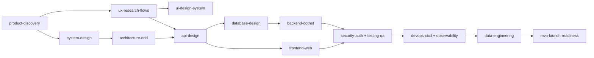

# MVP Fullstack Skills

Bộ **Agent Skills** cho Claude Code giúp một software developer đi từ **ý tưởng → MVP production** theo quy trình có cổng chất lượng (gate) ở mỗi phase. Nguyên tắc (DDD, Clean Architecture, Modular Monolith, contract-first, test, DevOps, observability) **độc lập ngôn ngữ**; ví dụ mặc định viết bằng C#/.NET. Profile ngôn ngữ cho **C#, TypeScript, JavaScript, Go, Rust, Python** (và template để thêm Java, Kotlin, PHP…) giúp áp dụng cùng nguyên tắc bằng idiom và công cụ bản địa.

## Danh sách skill

| # | Skill | Vai trò |
|---|---|---|
| 0 | [`mvp-orchestrator`](skills/mvp-orchestrator) | Điều phối pipeline, chọn skill đúng phase, kiểm gate |
| 1 | [`product-discovery`](skills/product-discovery) | Problem, persona, scope MVP, user story, metric |
| 2 | [`ux-research-flows`](skills/ux-research-flows) | Journey, user flow, IA, wireframe, a11y |
| 3 | [`ui-design-system`](skills/ui-design-system) | Design tokens, component, responsive, hand-off |
| 4 | [`system-design`](skills/system-design) | NFR, capacity, C4, chọn hạ tầng, failure modes |
| 5 | [`architecture-ddd`](skills/architecture-ddd) | DDD, Clean/Onion, Modular Monolith vs Microservices, ADR |
| 6 | [`api-design`](skills/api-design) | REST/GraphQL/gRPC, OpenAPI contract-first |
| 7 | [`database-design`](skills/database-design) | ERD, index, EF Core/Dapper, migration, backup |
| 8 | [`backend-dotnet`](skills/backend-dotnet) | CQRS, MediatR, FluentValidation, Outbox, Redis, RabbitMQ |
| 9 | [`frontend-web`](skills/frontend-web) | React/Next.js, TanStack Query, form, perf, E2E |
| 10 | [`security-auth`](skills/security-auth) | STRIDE, OIDC, RBAC/policy, OWASP, secret |
| 11 | [`testing-qa`](skills/testing-qa) | Pyramid, Testcontainers, architecture test, k6 |
| 12 | [`devops-cicd`](skills/devops-cicd) | Docker, GitHub Actions, IaC, K8s/PaaS, rollback |
| 13 | [`observability`](skills/observability) | Serilog + Seq/ELK, OpenTelemetry, SLO, alert |
| 14 | [`data-engineering`](skills/data-engineering) | Tracking plan, ELT, dbt, data quality, dashboard |
| 15 | [`mvp-launch-readiness`](skills/mvp-launch-readiness) | Go/No-Go, rollout, post-launch |
| — | [`conventional-commit`](skills/conventional-commit) | Commit/PR title theo Conventional Commits 1.0.0, SemVer, commitlint |
| — | [`project-bootstrap`](skills/project-bootstrap) | Khung solution .NET Modular Monolith chạy được ngày đầu |
| — | [`messaging-integration`](skills/messaging-integration) | RabbitMQ/MassTransit, Outbox/Inbox, Saga, gRPC, webhook, ACL |
| — | [`project-planning`](skills/project-planning) | Roadmap, sprint, ước lượng, rủi ro, Definition of Done |
| — | [`git-workflow-release`](skills/git-workflow-release) | Branching, PR/review, SemVer, release-please, hotfix |
| — | [`performance-engineering`](skills/performance-engineering) | Profiling .NET, EF/SQL, cache, k6, Web Vitals |
| — | [`saas-foundations`](skills/saas-foundations) | Multi-tenancy, subscription/billing, quota, email giao dịch |
| — | [`technical-documentation`](skills/technical-documentation) | Docs-as-code, ADR, C4, runbook, onboarding |
| — | [`incident-response`](skills/incident-response) | SEV, on-call, giảm thiểu, post-mortem không đổ lỗi |
| — | [`code-quality-refactoring`](skills/code-quality-refactoring) | Code smell, SOLID, refactor an toàn, analyzers, nợ kỹ thuật |
| — | [`cloud-infrastructure-finops`](skills/cloud-infrastructure-finops) | Azure/AWS, IaC, IAM, FinOps |
| — | [`legacy-migration`](skills/legacy-migration) | Strangler Fig, di chuyển dữ liệu, .NET Framework → .NET |
| — | [`ai-llm-integration`](skills/ai-llm-integration) | LLM, RAG, tool use, evals, guardrails |
| — | [`mobile-app`](skills/mobile-app) | PWA/React Native/MAUI, offline-first, phát hành store |
| — | [`compliance-privacy`](skills/compliance-privacy) | GDPR, Nghị định 13, quyền chủ thể, PCI, SOC 2 |
| — | [`stack-selector`](skills/stack-selector) | Chọn ngôn ngữ theo bài toán, quy tắc polyglot, bảng tương đương công cụ |
| — | [`lang-csharp`](skills/lang-csharp) | Profile C#/.NET |
| — | [`lang-typescript`](skills/lang-typescript) | Profile TypeScript (Node/Bun/Deno, full-stack) |
| — | [`lang-javascript`](skills/lang-javascript) | Profile JavaScript thuần (ESM, JSDoc + checkJs) |
| — | [`lang-go`](skills/lang-go) | Profile Go (hexagonal, goroutine/context, sqlc) |
| — | [`lang-rust`](skills/lang-rust) | Profile Rust (Cargo workspace theo tầng, Axum, SQLx) |
| — | [`lang-python`](skills/lang-python) | Profile Python (FastAPI, Pydantic, SQLAlchemy, uv/ruff/mypy) |
| — | [`language-profile-template`](skills/language-profile-template) | Khung 13 mục để thêm ngôn ngữ mới |

Skill 0–15 là đường chính từ ý tưởng đến MVP; các dòng `—` là skill bổ trợ, `mvp-orchestrator` chỉ khi nào gọi.

## Luồng làm việc



Mỗi skill ghi artifact vào `docs/` của dự án đích (`00-product-brief.md` … `11-launch-checklist.md`) để các phase sau tái sử dụng.

## Làm việc đa ngôn ngữ

1. `stack-selector`: chọn ngôn ngữ cho từng thành phần (API, worker, data, CLI, frontend); tối đa 2 ngôn ngữ backend cho MVP, ranh giới là contract (OpenAPI/proto).
2. Mở profile `lang-*` tương ứng: toolchain, layout Clean/DDD, thư viện, idiom Aggregate/Value Object, lỗi, đồng thời, test, Docker, CI, profiling.
3. Các skill nguyên tắc (`architecture-ddd`, `api-design`, `database-design`, `testing-qa`, `devops-cicd`, `observability`…) có mục **Đa ngôn ngữ** chỉ ra công cụ tương đương.

Ví dụ trong các profile được thử biên dịch/chạy (Go, Rust, TypeScript strict, JavaScript, Python); ví dụ C# chưa được biên dịch trong môi trường tạo skill.

## Cài đặt

**Dùng như plugin** (repo có `.claude-plugin/plugin.json`): thêm repo làm marketplace/plugin trong Claude Code.

**Hoặc copy thủ công:**
```bash
# cho 1 dự án
cp -r skills/* <project>/.claude/skills/
# cho toàn máy
cp -r skills/* ~/.claude/skills/
```

## Cách dùng
- Bắt đầu: *"Dùng mvp-orchestrator, tôi muốn làm hệ thống <mô tả> từ 0 đến MVP."*
- Hoặc gọi trực tiếp từng skill: *"Dùng architecture-ddd để Event Storming module Ordering."*

## Quy ước commit

Repo dùng [Conventional Commits 1.0.0](https://www.conventionalcommits.org/en/v1.0.0/) (xem skill [`conventional-commit`](skills/conventional-commit)). Mỗi pull request được kiểm bằng commitlint (`commitlint.config.mjs`, `.github/workflows/commitlint.yml`). Kiểm cục bộ:

```bash
npx --yes -p @commitlint/cli -p @commitlint/config-conventional commitlint --from origin/main --config commitlint.config.mjs
```

## Triết lý
KISS · YAGNI · DRY · SOLID — **Modular Monolith trước, Microservices khi có bằng chứng**; thin vertical slice; quyết định ghi ADR; test + observability là một phần của MVP, không phải "để sau".

## Tuỳ biến
Thay stack: sửa mục "Chọn stack" trong `frontend-web`, `database-design`, `devops-cicd`; ví dụ code C# nằm ở `architecture-ddd`, `backend-dotnet`, `testing-qa`, `observability`.
