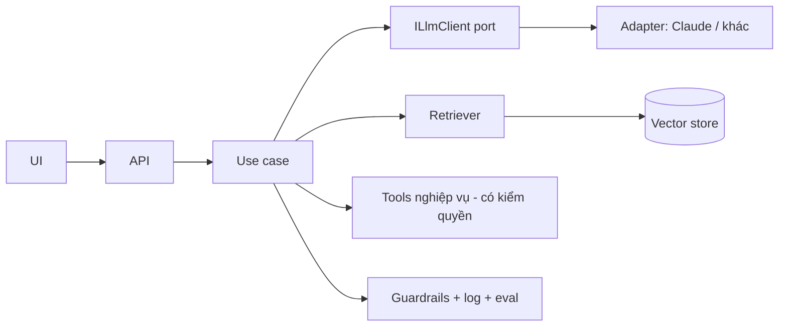

# AI / LLM Integration

> Khi viết code gọi Claude API/SDK, dùng skill `claude-api` để lấy model ID, tham số và ví dụ chính xác mới nhất; không tự nhớ.

## Đầu ra
`docs/18-ai-design.md` (use case, kiến trúc, eval, rủi ro) + module `Ai` cô lập sau interface.

## 1. Có thật sự cần LLM?
Dùng khi: ngôn ngữ tự nhiên là đầu vào/ra, dữ liệu phi cấu trúc, tác vụ mờ khó viết luật. Không dùng khi: luật xác định (dùng code), cần đúng tuyệt đối (tiền, quyền), độ trễ cực thấp. Bắt đầu bằng **prompt + API**, chỉ fine-tune khi đã chứng minh không đủ.

## 2. Kiến trúc trong ứng dụng

- Đặt LLM sau **port/adapter** (Clean Architecture): thay nhà cung cấp/mô hình không đụng domain; mock được trong test.
- Gọi **bất đồng bộ + streaming** (SSE/SignalR) cho trải nghiệm tốt; timeout, retry có backoff, circuit breaker (Polly), giới hạn đồng thời.
- Domain **không tin** đầu ra LLM: validate trước khi dùng.

## 3. Prompt & đầu ra có cấu trúc
- Prompt hệ thống: vai trò, mục tiêu, ràng buộc, định dạng; ví dụ (few-shot) cho trường hợp khó; tách rõ **chỉ dẫn** và **dữ liệu không tin cậy**.
- Yêu cầu **structured output** (JSON schema / tool use) và parse bằng kiểu mạnh + FluentValidation; lỗi parse → retry có phản hồi lỗi, rồi fallback.
- Version hoá prompt trong repo (file/template), gắn id vào log; thay đổi prompt đi qua eval như thay đổi code.

## 4. Tool use / Agent
Cho mô hình gọi **hàm có kiểm soát**: mô tả rõ, tham số có schema, quyền kiểm ở phía server (theo người dùng/tenant), thao tác ghi cần xác nhận con người, giới hạn số bước và ngân sách token, log đầy đủ từng bước. Bắt đầu bằng workflow cố định (chuỗi bước), chỉ dùng agent tự quyết khi cần.

## 5. RAG (hỏi đáp trên dữ liệu của bạn)
1. **Ingest**: trích văn bản → chunk theo cấu trúc (300–800 token, chồng lấn nhẹ, giữ tiêu đề/metadata) → embedding → lưu (pgvector, Qdrant, Azure AI Search).
2. **Truy xuất**: tìm lai (vector + từ khoá/BM25) → rerank → lọc theo quyền/tenant **trước** khi đưa vào prompt.
3. **Sinh câu trả lời**: chỉ dựa trên ngữ cảnh, trích nguồn, nói "không biết" khi thiếu; kiểm tra trích dẫn.
4. Cập nhật chỉ mục khi dữ liệu đổi (event); đo chất lượng truy xuất riêng với chất lượng sinh.

## 6. Đánh giá (evals) — bắt buộc
Bộ ca kiểm thử vàng (50–200 mẫu từ dữ liệu thật) + chấm tự động (so khớp, schema, LLM-as-judge có hiệu chuẩn) + chấm tay mẫu. Chạy eval trong CI khi đổi prompt/mô hình/retriever; theo dõi chất lượng production (thumbs up/down, tỉ lệ fallback, khiếu nại).

## 7. An toàn & quyền riêng tư
- **Prompt injection**: coi nội dung ngoài (web, email, tài liệu) là không tin cậy; không để nó điều khiển tool nhạy cảm; hạn chế quyền của agent (least privilege).
- Không đưa bí mật/PII không cần thiết vào prompt; che dữ liệu nhạy cảm; xem chính sách lưu giữ/huấn luyện của nhà cung cấp; ký DPA khi cần (`compliance-privacy`).
- Lọc đầu vào/ra (nội dung độc hại, rò rỉ), giới hạn tốc độ theo người dùng, nhãn "do AI tạo", đường chuyển cho con người.

## 8. Chi phí & độ trễ
Chọn mô hình nhỏ/nhanh cho tác vụ đơn giản, mô hình mạnh cho khó (định tuyến); **prompt caching** cho tiền tố lớn lặp lại; cắt ngữ cảnh thừa; batch cho việc không cần realtime; cache kết quả xác định; đặt trần ngân sách token theo tenant/người dùng; theo dõi token, chi phí/yêu cầu, p95 độ trễ (`observability`).

## Gate
- [ ] LLM nằm sau port; có mock và fallback khi lỗi/timeout
- [ ] Có bộ eval chạy được và ngưỡng chất lượng chấp nhận
- [ ] Đầu ra được validate; tool kiểm quyền phía server
- [ ] Có giới hạn chi phí, log/trace từng lời gọi, đánh giá rủi ro prompt injection và PII

## Anti-patterns
Tin tuyệt đối đầu ra LLM; ghép chuỗi prompt với input người dùng không tách biệt; không có eval ("thấy ổn là ship"); agent có quyền ghi rộng; bỏ lọc quyền khi RAG; gọi mô hình đắt nhất cho mọi tác vụ; khoá cứng vào một nhà cung cấp trong domain.
