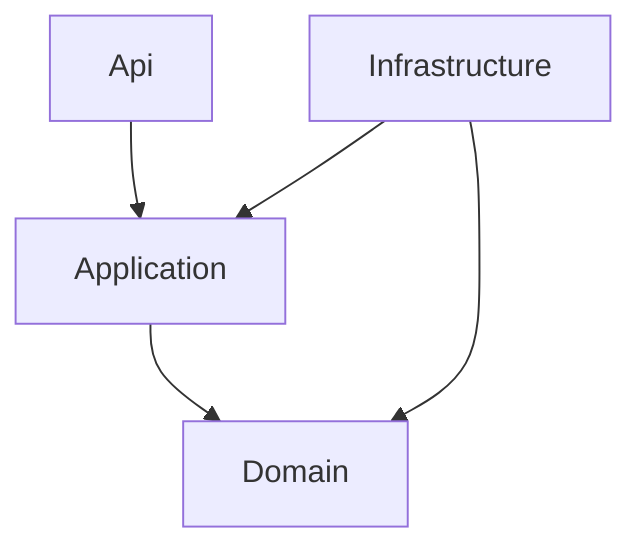

# Architecture & DDD (.NET)

## Đầu ra
`docs/04-architecture.md` + `docs/adr/*.md` + khung solution

## 1. Khám phá miền (Strategic DDD)
1. **Event Storming** (big picture): liệt kê Domain Event quá khứ (`OrderPlaced`, `PaymentCaptured`) → command → aggregate → policy → read model.
2. **Ubiquitous Language**: glossary dùng thống nhất trong code, DB, UI, tài liệu.
3. **Bounded Context + Context Map**: phân loại subdomain *Core / Supporting / Generic*. Core → tự làm kỹ; Generic (auth, email, payment) → mua/dùng thư viện.
4. Quan hệ context: Customer–Supplier, Conformist, ACL (Anti-Corruption Layer), Shared Kernel (hạn chế).

## 2. Chọn kiểu triển khai
| Tiêu chí | Modular Monolith | Microservices |
|---|---|---|
| Độ phức tạp vận hành | Thấp | Cao (K8s, tracing, service mesh) |
| Giao dịch | ACID trong 1 DB | Saga/eventual consistency |
| Tốc độ phát triển giai đoạn đầu | Cao | Thấp |
| Scale độc lập | Hạn chế | Tốt |
| Phù hợp | MVP, đội < 10, miền chưa ổn định | Nhiều đội, ranh giới đã ổn định, tải khác biệt lớn |

**Mặc định MVP: Modular Monolith** — mỗi module = 1 bounded context, giao tiếp qua *public contract* (interface/integration event), **DB schema riêng mỗi module**, cấm tham chiếu chéo nội bộ (kiểm bằng NetArchTest). Tách microservice sau khi ranh giới ổn định (Strangler Fig).

## 3. Cấu trúc solution (Clean/Onion)
```
src/
  BuildingBlocks/            # Entity, AggregateRoot, IDomainEvent, Result, Specification
  Modules/
    Ordering/
      Ordering.Domain/       # Entity, VO, Aggregate, Domain Event, Domain Service  (KHÔNG phụ thuộc gì)
      Ordering.Application/  # Use case (CQRS handlers), ports (interfaces), validators
      Ordering.Infrastructure/ # EF Core, Repository impl, Outbox, adapters
      Ordering.Contracts/    # Integration events + API public cho module khác
  Host/Api/                  # ASP.NET Core composition root, endpoints
tests/
```
Quy tắc phụ thuộc: `Domain ← Application ← Infrastructure/Api` (hướng vào trong). Domain không biết EF Core, MediatR hay HTTP.



## 4. Tactical DDD với C#
```csharp
public abstract class AggregateRoot : Entity
{
    private readonly List<IDomainEvent> _events = new();
    public IReadOnlyCollection<IDomainEvent> DomainEvents => _events;
    protected void Raise(IDomainEvent e) => _events.Add(e);
    public void ClearEvents() => _events.Clear();
}

public sealed record Money(decimal Amount, string Currency)   // Value Object
{
    public static Money Of(decimal a, string c) =>
        a < 0 ? throw new DomainException("Amount must be >= 0") : new(a, c);
    public Money Add(Money o) => Currency == o.Currency ? this with { Amount = Amount + o.Amount }
                                                       : throw new DomainException("Currency mismatch");
}

public sealed class Order : AggregateRoot                      // Aggregate Root bảo vệ invariant
{
    private readonly List<OrderLine> _lines = new();
    public OrderId Id { get; private set; }
    public OrderStatus Status { get; private set; } = OrderStatus.Draft;
    public IReadOnlyList<OrderLine> Lines => _lines;
    private Order() { }                                         // EF Core

    public static Order Create(CustomerId c) => new() { Id = OrderId.New() };

    public void AddLine(ProductId p, int qty, Money price)
    {
        if (Status != OrderStatus.Draft) throw new DomainException("Order is locked");
        if (qty <= 0) throw new DomainException("Quantity must be positive");
        _lines.Add(new OrderLine(p, qty, price));
    }
    public void Place()
    {
        if (_lines.Count == 0) throw new DomainException("Empty order");
        Status = OrderStatus.Placed;
        Raise(new OrderPlaced(Id, DateTime.UtcNow));
    }
}
```
Quy tắc aggregate: 1 transaction = 1 aggregate; tham chiếu aggregate khác bằng **ID**; aggregate nhỏ; invariant nằm trong domain, không nằm trong service/controller.

## 5. Design patterns hay dùng (GoF + Enterprise)
- **Strategy** (tính phí/giảm giá), **Decorator** (logging/caching handler qua MediatR Pipeline), **Factory** (tạo aggregate), **Adapter/ACL** (tích hợp bên thứ ba), **Observer** (Domain Event).
- **Repository + Unit of Work** (DbContext là UoW), **Specification** cho query nghiệp vụ tái sử dụng, **Outbox** cho độ tin cậy event, **CQRS** (xem `backend-dotnet`), **Event Sourcing** chỉ khi cần audit/temporal nghiêm ngặt.

## 6. Ghi ADR
```markdown
# ADR-0001: Chọn Modular Monolith
Status: Accepted | Context | Decision | Consequences | Alternatives considered
```

## Gate
- [ ] Context map + glossary
- [ ] Mỗi module có owner, public contract, schema riêng
- [ ] Test kiến trúc (NetArchTest/ArchUnitNET) bảo vệ quy tắc phụ thuộc
- [ ] ADR cho: monolith vs microservices, DB, auth, messaging

## Anti-patterns
Anemic domain model (entity chỉ có getter/setter); "microservices" chia theo bảng CRUD; DDD đầy đủ cho phần CRUD đơn giản (dùng transaction script cho Supporting/Generic); module truy cập thẳng bảng của module khác.
