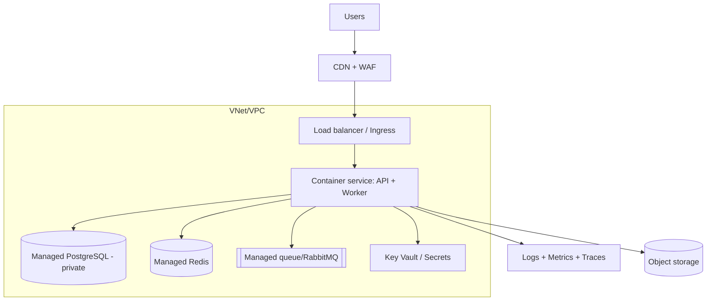

# Cloud Infrastructure & FinOps

## Đầu ra
`docs/16-infrastructure.md` (sơ đồ hạ tầng, quyết định, ước tính chi phí) + `deploy/iac/` (Terraform/Bicep).

## 1. Chọn nền tảng
| Tiêu chí | Gợi ý |
|---|---|
| Stack .NET, tích hợp Entra ID/DevOps | **Azure** (App Service/Container Apps, Azure SQL/PostgreSQL Flexible, Service Bus, Key Vault) |
| Hệ sinh thái rộng, nhiều dịch vụ | AWS (ECS Fargate/App Runner, RDS, SQS/SNS, Secrets Manager) |
| Khởi động nhanh, chi phí thấp | PaaS: Fly.io, Railway, Render |
Ưu tiên **dịch vụ managed** (DB, queue, cache) thay vì tự vận hành; tránh khoá chặt không cần thiết bằng cách giữ ứng dụng container hoá và cấu hình qua env.

## 2. Kiến trúc tham chiếu MVP

DB/cache **không có IP công khai**; chỉ truy cập qua mạng riêng/private endpoint.

## 3. Nền tảng an toàn (landing zone tối thiểu)
- Tách **subscription/account** theo môi trường (dev/staging/prod) hoặc tối thiểu tách resource group + IAM.
- **IAM least privilege**: managed identity/IAM role cho workload, không dùng khoá dài hạn; con người đăng nhập SSO + MFA; không dùng root/owner hằng ngày.
- Mạng: subnet riêng (app/data), security group chỉ mở cổng cần, egress có kiểm soát, WAF cho entrypoint.
- Bật audit log của nền tảng (CloudTrail/Activity Log), chính sách bắt buộc tag, mã hoá at-rest bằng khoá quản lý.

## 4. Infrastructure as Code
- Terraform (đa cloud) hoặc Bicep (Azure) — **mọi tài nguyên qua code**, review qua PR.
- Cấu trúc: `modules/` (network, database, app) + `envs/dev|staging|prod`; state từ xa có khoá (S3+DynamoDB / Azure Storage); `plan` tự chạy trên PR, `apply` có phê duyệt.
- Quét IaC (tfsec/Checkov/trivy config), phát hiện drift định kỳ. Không sửa tay trên portal (nếu buộc, nhập lại vào code).

## 5. Độ tin cậy & khôi phục
Đa AZ cho DB và app; backup tự động + **thử restore**; xác định RPO/RTO từ `system-design`; kế hoạch DR (backup cross-region là đủ cho MVP, active-active là quá mức); health probe + autoscale theo CPU/RPS/queue depth.

## 6. FinOps — kiểm soát chi phí
1. **Ước tính trước** (calculator): app, DB, cache, queue, băng thông ra, log ingest, storage — ghi vào tài liệu.
2. **Budget + alert** ở 50/80/100% và cảnh báo bất thường; chủ sở hữu rõ ràng.
3. **Tagging bắt buộc**: `env`, `service`, `owner`, `cost-center` → báo cáo chi phí theo dịch vụ/tenant.
4. Đúng cỡ (right-size) theo số liệu thực; autoscale về tối thiểu; **tắt staging/dev ngoài giờ**.
5. Reserved/Savings Plan chỉ khi tải ổn định ≥ 3 tháng; spot cho worker chịu lỗi.
6. Cắt khoản ẩn: **log ingest** (giảm mức, sample trace), băng thông ra/NAT, snapshot cũ, IP/ổ đĩa mồ côi, môi trường quên tắt.
7. Rà soát chi phí hàng tháng 30 phút; chi phí trên mỗi người dùng/tenant là chỉ số sản phẩm.

## Gate
- [ ] Toàn bộ hạ tầng dựng lại được từ IaC trên môi trường mới
- [ ] DB/cache không public; secret trong Key Vault; workload dùng managed identity
- [ ] Budget alert + tag bắt buộc đang hoạt động
- [ ] Backup đã thử restore; chi phí dự kiến/tháng đã được duyệt

## Anti-patterns
Click portal rồi quên ghi lại; một tài khoản/quyền Owner cho tất cả; DB mở ra internet; không giới hạn chi phí; chọn Kubernetes tự quản cho 1–2 service; bỏ qua băng thông ra và log khi ước tính; chạy staging 24/7 cỡ production.
