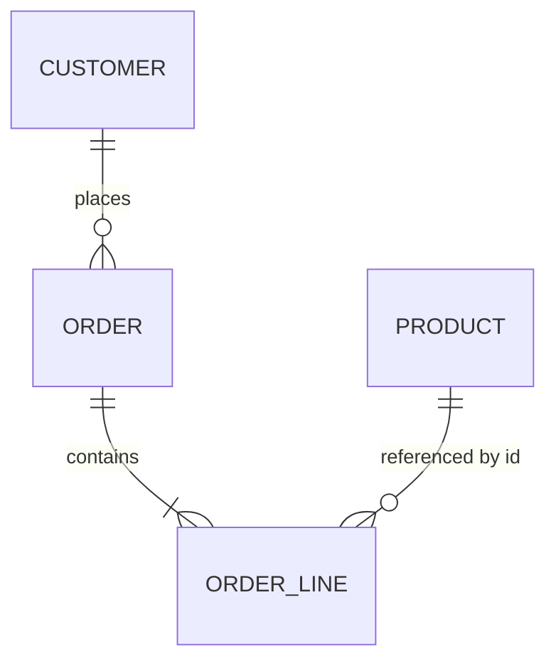

# Database Design

## Đầu ra
`docs/05-data-model.md` (ERD Mermaid + quyết định) + migration trong `src/**/Migrations`

## Chọn database
| Nhu cầu | Chọn |
|---|---|
| Dữ liệu giao dịch, quan hệ (mặc định) | **PostgreSQL** hoặc SQL Server |
| Cache, session, rate-limit, lock | Redis |
| Tài liệu linh hoạt / log sự kiện | MongoDB / PostgreSQL `jsonb` |
| Tìm kiếm full-text/facet | Postgres FTS → OpenSearch khi cần |
| Phân tích | Columnar/warehouse (xem `data-engineering`) |
Mặc định MVP: **1 PostgreSQL**, **mỗi module một schema**. Polyglot khi có lý do đo được.

## Quy trình
1. **Từ Aggregate → bảng**: 1 aggregate root = 1 bảng chính + bảng con cho entity nội bộ; Value Object → owned type/cột; tham chiếu aggregate khác chỉ bằng ID (không FK chéo module).
2. **Chuẩn hoá 3NF** cho OLTP; phi chuẩn hoá có chủ đích cho read model.
3. **Khoá**: PK `uuid` (UUIDv7 để index thân thiện) hoặc `bigint identity`; natural key làm unique constraint.
4. **Cột chuẩn**: `created_at`, `updated_at` (UTC), `row_version` (concurrency), `is_deleted`/`deleted_at` nếu cần soft delete, `tenant_id` nếu multi-tenant.
5. **Index theo truy vấn thật**: liệt kê top query → composite index (thứ tự cột: equality → range → sort); partial index; không index thừa. Kiểm bằng `EXPLAIN (ANALYZE, BUFFERS)`.
6. **Ràng buộc ở DB**: NOT NULL, UNIQUE, CHECK, FK (trong cùng module) — DB là hàng rào cuối cùng.
7. **Migration**: code-first EF Core, mỗi PR một migration, không sửa migration đã áp dụng; chiến lược *expand → migrate → contract* cho thay đổi phá vỡ; chạy migration bằng job riêng, không lúc app start ở production.
8. **Concurrency**: optimistic (`rowversion`/`xmin`) cho đa số; `SELECT … FOR UPDATE` hay advisory lock cho tồn kho/số dư.
9. **Backup & khôi phục**: backup tự động, **thử restore** ít nhất 1 lần trước launch; PITR nếu có.
10. **Multi-tenancy** (nếu SaaS): schema-per-tenant / `tenant_id` + Row-Level Security; EF global query filter.

## EF Core (cấu hình aggregate)
```csharp
public sealed class OrderConfig : IEntityTypeConfiguration<Order>
{
    public void Configure(EntityTypeBuilder<Order> b)
    {
        b.ToTable("orders", "ordering");
        b.HasKey(o => o.Id);
        b.Property(o => o.Id).HasConversion(id => id.Value, v => new OrderId(v));
        b.Property(o => o.Status).HasConversion<string>().HasMaxLength(20);
        b.Property<uint>("xmin").IsRowVersion();                       // Postgres concurrency
        b.OwnsMany(o => o.Lines, l => {
            l.ToTable("order_lines", "ordering");
            l.WithOwner().HasForeignKey("order_id");
            l.OwnsOne(x => x.UnitPrice, m => { m.Property(p => p.Amount).HasColumnName("unit_amount").HasPrecision(18,2);
                                               m.Property(p => p.Currency).HasColumnName("currency").HasMaxLength(3); });
        });
        b.HasIndex(o => new { o.CustomerId, o.CreatedAt }).IsDescending(false, true);
    }
}
```
**EF Core vs Dapper**: EF Core cho write side (aggregate, change tracking); **Dapper** cho read side/report phức tạp (CQRS) — cùng connection, không trộn trong một transaction nếu tránh được.

## ERD mẫu


## Gate
- [ ] ERD + giải thích khoá/index cho top 10 query
- [ ] Migration chạy sạch từ DB rỗng (CI) và seed dữ liệu dev
- [ ] Đã thử restore backup
- [ ] Quy ước đặt tên + múi giờ UTC thống nhất

## Anti-patterns
Lưu tiền bằng `float`; EAV tuỳ tiện; N+1 do lazy loading; thiếu index FK; business logic trong stored procedure rải rác; chia sẻ bảng giữa các module.

## Đa ngôn ngữ

| Ngôn ngữ | Truy cập dữ liệu | Migration |
|---|---|---|
| C# | EF Core (ghi), Dapper (đọc) | EF Migrations, DbUp |
| TypeScript/JS | Drizzle, Kysely, Prisma | drizzle-kit, Prisma Migrate, Knex |
| Go | pgx + sqlc, GORM, ent | goose, atlas, golang-migrate |
| Rust | SQLx (kiểm query lúc compile), SeaORM, Diesel | `sqlx migrate`, refinery |
| Python | SQLAlchemy 2 | Alembic |

Nguyên tắc không đổi: aggregate → bảng, index theo truy vấn thật, expand → migrate → contract, migration chạy bằng job riêng, thử restore backup.
