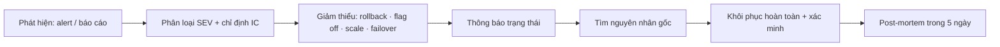

# Incident Response

## Đầu ra
`docs/runbooks/incident-process.md`, mẫu post-mortem, lịch on-call, trang status.

## Mức độ nghiêm trọng
| Mức | Mô tả | Phản hồi |
|---|---|---|
| **SEV1** | Ngừng dịch vụ, mất/lộ dữ liệu, mất doanh thu diện rộng | Gọi ngay 24/7, cập nhật 30 phút/lần |
| **SEV2** | Chức năng chính suy giảm nghiêm trọng, nhiều người bị ảnh hưởng | Trong giờ làm + on-call, cập nhật 1 giờ/lần |
| **SEV3** | Lỗi cục bộ, có cách tạm thời | Ticket, xử lý trong ngày/tuần |
Nghi ngờ thì **nâng mức**, hạ sau.

## Vai trò (đội nhỏ có thể một người kiêm nhiều vai)
Incident Commander (điều phối, ra quyết định) · Operator (thao tác kỹ thuật) · Communicator (cập nhật người dùng/stakeholder) · Scribe (ghi timeline).

## Luồng xử lý

**Nguyên tắc vàng: giảm thiểu trước, tìm nguyên nhân sau.** Hành động đầu tiên thường là *rollback* bản deploy gần nhất hoặc tắt feature flag, không phải debug sâu.

## Checklist 10 phút đầu
1. Xác nhận có thật (dashboard, synthetic check), phạm vi ảnh hưởng (bao nhiêu người, tenant nào).
2. Có thay đổi gần đây? (deploy, migration, cấu hình, hạ tầng, đối tác ngoài).
3. Mở kênh sự cố, ghi giờ bắt đầu, chỉ định IC.
4. Rollback / tắt flag / chuyển hướng tải nếu nghi do thay đổi.
5. Cập nhật trang status: *đang điều tra* (không đoán nguyên nhân).
6. Ghi lại mọi hành động kèm giờ.

## Giao tiếp
Ngắn, đều đặn, trung thực: *chuyện gì ảnh hưởng · ai bị · đang làm gì · lần cập nhật tiếp theo lúc mấy giờ*. Sau sự cố gửi tóm tắt cho người dùng bị ảnh hưởng (xin lỗi cụ thể, không đổ lỗi bên thứ ba). Sự cố liên quan dữ liệu cá nhân → xem nghĩa vụ báo cáo trong `compliance-privacy` (ví dụ GDPR 72 giờ).

## On-call
Lịch xoay vòng công bằng, tối thiểu 2 người hiểu hệ thống, tài liệu bàn giao, ngưỡng page rõ ràng (`observability`: chỉ page khi cần hành động ngay), bù trừ thời gian nghỉ, tắt alert ồn. Mỗi alert page có runbook.

## Post-mortem không đổ lỗi
```markdown
# Post-mortem: <tiêu đề> — SEV2 — 2026-03-14
## Tóm tắt · Tác động (thời lượng, số người, doanh thu)
## Timeline (giờ UTC): phát hiện → giảm thiểu → khôi phục
## Nguyên nhân gốc & yếu tố góp phần (5 Whys; hệ thống, không phải cá nhân)
## Điều đã tốt · Điều chưa tốt · May mắn
## Hành động: [việc] — [chủ sở hữu] — [hạn] — [phòng ngừa/phát hiện/giảm thiểu]
```
Họp trong 5 ngày làm việc; hành động được theo dõi như backlog thường và có hạn; chia sẻ rộng rãi.

## Học tập có hệ thống
Theo dõi MTTD, MTTR, số sự cố/tháng, **error budget** theo SLO (`observability`): cạn budget → đóng băng tính năng, ưu tiên độ tin cậy. Diễn tập định kỳ (game day, restore backup, failover thử).

## Gate
- [ ] Có định nghĩa SEV, lịch on-call, kênh sự cố và trang status
- [ ] Runbook cho top 5 kịch bản (deploy hỏng, DB đầy/chậm, queue ùn, đối tác sập, hết hạn chứng chỉ)
- [ ] Đã diễn tập ít nhất 1 sự cố giả lập
- [ ] Mẫu post-mortem sẵn sàng, hành động có chủ và hạn

## Anti-patterns
Debug trực tiếp trên production khi chưa giảm thiểu; nhiều người cùng thao tác không ai điều phối; im lặng với người dùng; post-mortem tìm người có lỗi; hành động khắc phục không ai theo dõi; thiếu on-call thật sự.
