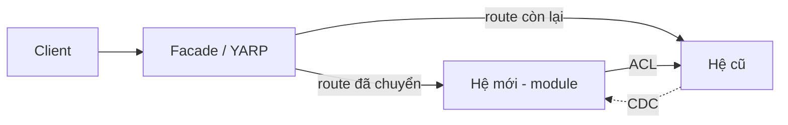

# Legacy Migration & Modernization

## Đầu ra
`docs/17-migration-plan.md` (hiện trạng, chiến lược, thứ tự cắt, rollback) + ADR cho mỗi quyết định.

## Nguyên tắc
**Không "big bang rewrite".** Hệ thống cũ vẫn tạo ra giá trị; di chuyển từng phần nhỏ, mỗi bước **triển khai được và quay lui được**. Mục tiêu mỗi bước là giảm rủi ro, không phải đẹp kiến trúc.

## 1. Đánh giá hiện trạng
1. Bản đồ hệ thống: thành phần, phụ thuộc, luồng dữ liệu, tích hợp ngoài, nơi chạy.
2. Đo thật: truy cập nào xảy ra nhiều (log, APM), chức năng nào không ai dùng (để **xoá thay vì chuyển**).
3. Phân loại từng khối: *Giữ nguyên · Lift & shift · Re-platform · Refactor · Rewrite · Retire* (6R).
4. Rủi ro: thiếu test, thiếu tài liệu, người nắm kiến thức, dữ liệu bẩn, phụ thuộc phiên bản cũ.
5. Tìm **seam** (đường nối tự nhiên) để cắt: theo bounded context (`architecture-ddd`), theo URL, theo dữ liệu.

## 2. Mẫu chiến lược
| Mẫu | Cách làm | Khi dùng |
|---|---|---|
| **Strangler Fig** | Đặt facade/proxy (YARP, API gateway) trước hệ thống cũ; định tuyến dần từng route sang hệ mới | Mặc định cho web/API |
| **Branch by Abstraction** | Đặt interface quanh phần cũ → thêm implementation mới → chuyển bằng flag → xoá cũ | Thay thế thành phần bên trong |
| **Anti-Corruption Layer** | Lớp dịch model cũ ↔ model mới | Hai hệ thống sống chung lâu |
| **Parallel Run / Shadow** | Chạy cả hai, so sánh kết quả, người dùng vẫn nhận kết quả cũ | Logic nghiệp vụ nhạy cảm (tính tiền) |
| **Event interception / CDC** | Bắt thay đổi DB cũ (Debezium) để đồng bộ sang hệ mới | Cần dữ liệu cho hệ mới trước khi cắt |


```csharp
// YARP: chuyển dần từng route
"Routes": {
  "orders-new":  { "ClusterId": "new",    "Match": { "Path": "/api/orders/{**rest}" } },
  "catch-all":   { "ClusterId": "legacy", "Match": { "Path": "{**catch-all}" }, "Order": 100 }
}
```

## 3. Di chuyển dữ liệu (không downtime)
**Expand → Migrate → Contract**: thêm cấu trúc mới (tương thích ngược) → ghi kép/đồng bộ + backfill theo lô → chuyển đọc sang mới (có thể đối chiếu) → chuyển ghi → gỡ cấu trúc cũ. Kiểm tra bằng đối soát (count, checksum, mẫu ngẫu nhiên), chạy lại được (idempotent), có kế hoạch rollback đến lúc cắt hẳn. Tránh DB dùng chung lâu dài giữa hai hệ.

## 4. .NET Framework → .NET hiện đại
Dùng .NET Upgrade Assistant + `try-convert`; chạy `dotnet-outdated` và analyzer tương thích; tách thư viện sang `netstandard2.0`/multi-target trước; thay `System.Web` (Web API 2/MVC5) bằng ASP.NET Core theo từng controller (qua YARP/`System.Web` adapters); EF6 → EF Core theo module; WCF → gRPC/CoreWCF; cấu hình `web.config` → `appsettings` + env. Mỗi bước build + test xanh.

## 5. Tách monolith → service
Chỉ khi có lý do đo được (tải khác biệt, đội độc lập, vòng đời deploy khác). Thứ tự: **Modular Monolith trước** (ranh giới module, schema riêng) → thay gọi nội bộ bằng contract/event → khi ổn định mới tách process. Mỗi service sở hữu dữ liệu của nó; cắt JOIN chéo bằng event/API.

## 6. Thực thi
1. **Characterization test**/golden master quanh hành vi cũ trước khi đụng vào.
2. Cắt lát nhỏ nhất có giá trị → chuyển 1% → 10% → 100% (canary/feature flag).
3. Mỗi lát: tiêu chí chuyển, tiêu chí **rollback**, metric so sánh (lỗi, latency, kết quả nghiệp vụ).
4. Song song vận hành → khi ổn định **xoá code cũ** (nếu không sẽ có hai hệ thống mãi mãi).
5. Giao tiếp với người dùng và đội vận hành; đóng băng thay đổi cũ ở phần đang chuyển.

## Gate
- [ ] Có bản đồ hiện trạng và phân loại 6R cho từng khối
- [ ] Mỗi bước độc lập triển khai và rollback được
- [ ] Đối soát dữ liệu tự động đạt trước khi chuyển ghi
- [ ] Lịch xoá hệ thống/code cũ có chủ sở hữu

## Anti-patterns
Viết lại toàn bộ từ đầu; chuyển dữ liệu một lần vào cuối tuần không đường lui; hai hệ thống ghi chung một bảng mãi mãi; di chuyển cả những chức năng không ai dùng; để lớp tương thích tạm thời trở thành vĩnh viễn.
