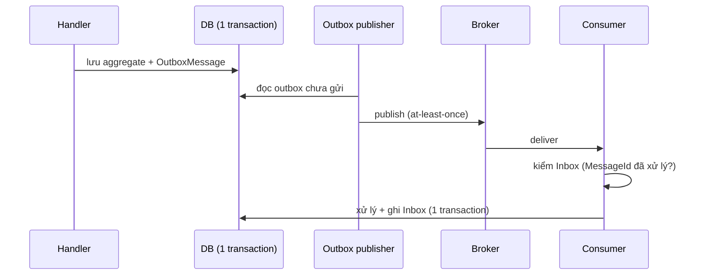

# Messaging & Integration

## Đầu ra
`docs/12-integration.md` (event catalog, contract, SLA bên thứ ba) + code messaging trong `Infrastructure`/`Contracts`.

## Chọn kiểu giao tiếp
| Nhu cầu | Chọn | Ghi chú |
|---|---|---|
| Module trong monolith cần phản ứng event | In-process domain/integration event (MediatR) + Outbox | Chưa cần broker |
| Fan-out, tách rời, chịu lỗi | **RabbitMQ** (hoặc Azure Service Bus) | Mặc định khi tách worker/service |
| Luồng sự kiện lớn, replay | Kafka | Chỉ khi thực sự cần log bất biến |
| Gọi đồng bộ nội bộ hiệu năng cao | **gRPC** | Contract `.proto`, deadline bắt buộc |
| Đẩy tới trình duyệt | **SignalR** / SSE | Chỉ thông báo, logic ở handler |
| Đối tác gọi mình / mình thông báo ra ngoài | **Webhook** | Ký HMAC, retry, idempotency |

## Phân loại message
`Command` (gửi 1 nơi, mong đợi xử lý) · `Event` (đã xảy ra, nhiều subscriber, quá khứ: `OrderPlaced`) · `Query` (đồng bộ). Event đặt trong `*.Contracts`, **phiên bản hoá**, chỉ thêm field.

## Độ tin cậy: Outbox + Inbox

```csharp
services.AddMassTransit(x =>
{
    x.AddConsumers(typeof(OrderPlacedConsumer).Assembly);
    x.AddEntityFrameworkOutbox<OrderingDbContext>(o => { o.UsePostgres(); o.UseBusOutbox(); });
    x.UsingRabbitMq((ctx, cfg) =>
    {
        cfg.Host(configuration["Rabbit:Host"]);
        cfg.UseMessageRetry(r => r.Exponential(5, TimeSpan.FromSeconds(1), TimeSpan.FromMinutes(1), TimeSpan.FromSeconds(2)));
        cfg.ConfigureEndpoints(ctx);
    });
});
```
Quy tắc: **at-least-once** là mặc định → consumer **luôn idempotent** (khoá dedupe theo `MessageId`/business key). Không publish trước khi commit.

## Xử lý lỗi
- Retry có backoff + jitter cho lỗi tạm thời; **không retry** lỗi vĩnh viễn (validation) → đẩy thẳng DLQ.
- **Dead-letter queue** có cảnh báo + công cụ replay; poison message không được chặn queue.
- Giới hạn `PrefetchCount`/concurrency; xử lý thứ tự bằng partition key chỉ khi cần.

## Saga (giao dịch phân tán)
Chỉ dùng khi nghiệp vụ trải qua nhiều service/module có DB riêng. Orchestration (MassTransit state machine) cho luồng phức tạp; Choreography cho luồng ngắn. Mỗi bước có **compensating action** (huỷ đơn, hoàn tiền). Trong monolith 1 DB → dùng 1 transaction, đừng tạo Saga.

## Tích hợp bên thứ ba (ACL)
1. Bọc trong **Anti-Corruption Layer**: interface thuộc Application (`IPaymentGateway`), adapter ở Infrastructure; model của bên kia không rò vào Domain.
2. Polly: timeout, retry, circuit breaker, bulkhead; **Idempotency-Key** khi gọi bên kia.
3. **Webhook nhận**: xác thực chữ ký, kiểm timestamp chống replay, trả `2xx` nhanh rồi xử lý bất đồng bộ, dedupe theo event id.
4. **Webhook gửi**: retry backoff, chữ ký HMAC, trang xem lịch sử giao hàng.
5. Môi trường sandbox + contract test/mock (WireMock) trong CI; theo dõi quota và SLA.

## gRPC & SignalR
- gRPC: `.proto` trong repo, deadline + cancellation, interceptor logging/auth, không lộ ra internet công khai (dùng REST/gateway).
- SignalR: auth bằng token, group theo user/tenant, backplane Redis khi nhiều instance, client reconnect có backoff.

## Gate
- [ ] Event catalog: tên, schema, producer, consumer, version
- [ ] Mọi event quan trọng đi qua Outbox; mọi consumer idempotent (có test gửi trùng)
- [ ] DLQ có alert + quy trình replay
- [ ] Mỗi tích hợp ngoài có ACL, timeout, circuit breaker, runbook khi đối tác sập

## Anti-patterns
Dual-write (ghi DB rồi publish riêng, không Outbox); consumer không idempotent; event mang quá nhiều dữ liệu hoặc là "CRUD event"; gọi HTTP đồng bộ chuỗi dài giữa service; dùng Kafka/Saga khi monolith đủ; chia sẻ DB giữa service thay vì event.
