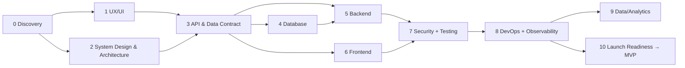

# MVP Orchestrator

Skill "nhạc trưởng": không tự thiết kế chi tiết, mà **chọn đúng skill chuyên môn cho đúng phase** và giữ các artifact nhất quán trong `docs/`.

## Nguyên tắc cốt lõi
- **Thin slice trước, rộng sau**: một luồng nghiệp vụ end-to-end chạy được (UI → API → DB → deploy) quan trọng hơn nhiều module dở dang.
- **KISS / YAGNI**: mặc định *Modular Monolith* + 1 database; chỉ tách microservice khi có bằng chứng (xem `architecture-ddd`).
- **Mọi quyết định lớn ghi thành ADR** (`docs/adr/NNNN-*.md`).
- **Không sang phase sau nếu gate phase trước chưa đạt** (hoặc ghi rõ rủi ro chấp nhận).

## Pipeline



| Phase | Skill | Artifact chính | Gate (đạt mới đi tiếp) |
|---|---|---|---|
| 0 | `product-discovery` | `docs/00-product-brief.md`, backlog MVP | Có 1 câu problem statement, ≤ 5 tính năng Must, success metric đo được |
| 1a | `ux-research-flows` | `docs/01-user-flows.md`, wireframe | Happy path + lỗi chính của mỗi Must-feature có flow |
| 1b | `ui-design-system` | `docs/02-design-tokens.md`, component list | Token + ≤ 15 component cơ bản được thống nhất |
| 2a | `system-design` | `docs/03-system-design.md` | NFR có số liệu, capacity ước lượng, diagram C4 mức 1–2 |
| 2b | `architecture-ddd` | `docs/04-architecture.md`, ADR | Bounded context + cấu trúc solution được chốt |
| 3 | `api-design` | `docs/api/openapi.yaml` | Contract duyệt bởi FE + BE |
| 4 | `database-design` | `docs/05-data-model.md`, migration | ERD + index cho query chính |
| 5 | `backend-dotnet` | Code `src/`, API chạy được | Use-case chính qua integration test |
| 6 | `frontend-web` | Code `web/` | Flow chính chạy với API thật |
| 7a | `security-auth` | `docs/06-security.md`, authN/Z | Checklist OWASP cơ bản đạt |
| 7b | `testing-qa` | `docs/07-test-strategy.md`, test suite + CI | Pyramid test chạy xanh trên CI |
| 8a | `devops-cicd` | `deploy/`, pipeline, `docs/08-runbook.md` | Deploy tự động lên staging |
| 8b | `observability` | log/metric/trace, `docs/09-slo-alerts.md` | Có dashboard + alert cho 4 golden signals |
| 9 | `data-engineering` | `docs/10-data-plan.md`, pipeline | Số liệu success metric xem được |
| 10 | `mvp-launch-readiness` | `docs/11-launch-checklist.md` | Go/No-Go ký duyệt |

## Cách điều phối
1. **Xác định điểm xuất phát**: hỏi/đọc repo để biết đã có artifact nào trong `docs/`. Bắt đầu từ phase đầu tiên còn thiếu.
2. **Chạy song song khi độc lập**: UX/UI song song System Design; FE và BE song song sau khi có OpenAPI.
3. **Sau mỗi phase**: tóm tắt ≤ 5 dòng (đã làm gì, quyết định, rủi ro mở) + nêu phase kế tiếp.
4. **Giữ traceability**: mỗi user story có ID (`US-01`) → được tham chiếu trong API endpoint, test, và commit.
5. **Cắt scope không thương tiếc**: nếu timeline nguy hiểm, cắt theo MoSCoW — không cắt test, security, observability nền tảng.

## Cấu trúc repo mặc định (monorepo)
```
/docs            # artifact từ các phase + adr/
/src             # backend .NET (Modular Monolith)
/web             # frontend
/deploy          # Dockerfile, compose, k8s/helm, IaC
/.github/workflows
```

## Anti-patterns
- Thiết kế microservices + Kubernetes cho đội < 5 người trước khi có người dùng đầu tiên.
- Làm đủ mọi layer cho tất cả tính năng thay vì hoàn thiện 1 lát cắt dọc.
- Bỏ qua observability "để sau" → không debug được khi MVP lên production.
