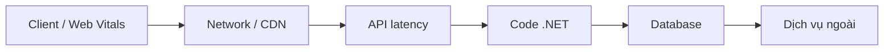

# Performance Engineering

## Đầu ra
`docs/14-performance.md`: baseline, bottleneck tìm được, thay đổi và kết quả trước/sau.

## Nguyên tắc
**Đo trước, tối ưu sau.** Không đoán. Chu trình: *Mục tiêu (NFR) → Đo baseline → Tìm nút thắt → Sửa một thứ → Đo lại → Ghi lại.* Tối ưu sớm thứ không nằm trên đường nóng là vi phạm YAGNI.

## 1. Đặt mục tiêu
Lấy từ `system-design`: p95/p99 latency, RPS đỉnh, tỉ lệ lỗi, tài nguyên tối đa. Xem **percentile**, không dùng trung bình.

## 2. Tìm nút thắt (từ ngoài vào trong)

- Dùng **trace phân tán** (`observability`) xem span nào chiếm thời gian.
- Công cụ .NET: `dotnet-counters` (live metrics), `dotnet-trace` / PerfView (CPU), `dotnet-gcdump`/`dotnet-dump` (bộ nhớ), Application Insights/Pyroscope (profiling liên tục), **BenchmarkDotNet** (micro-benchmark có kiểm soát).

## 3. Cơ sở dữ liệu (thường là thủ phạm số 1)
- Bật log SQL ở dev; tìm **N+1** (`Include`/projection/split query; tránh lazy loading).
- `AsNoTracking()` cho truy vấn đọc; `Select` đúng cột cần; phân trang cursor thay `OFFSET` lớn.
- `EXPLAIN (ANALYZE, BUFFERS)`: index thiếu, seq scan, sort tốn kém; composite index theo thứ tự equality → range → sort.
- Batch insert/update (`ExecuteUpdate`, `EFCore.BulkExtensions`), compiled queries cho đường nóng, Dapper cho báo cáo nặng.
- Giữ transaction ngắn; connection pool đủ (PgBouncer); đọc từ replica khi chấp nhận trễ.

## 4. Code .NET
- **async/await đúng**: không `.Result`/`.Wait()`, không `Task.Run` bọc I/O, truyền `CancellationToken`, `ConfigureAwait` không cần trong ASP.NET Core.
- Giảm cấp phát: `Span<T>`, `ArrayPool`, tránh LINQ nóng trong vòng lặp lớn, `StringBuilder`, `System.Text.Json` source generator.
- `HttpClientFactory` (không `new HttpClient()` mỗi lần), response compression, HTTP/2.
- Kiểm tra GC: Server GC khi nhiều core, theo dõi Gen2 và LOH.

## 5. Caching (chỉ sau khi đo)
| Tầng | Công cụ | Lưu ý |
|---|---|---|
| In-memory | `IMemoryCache` / `HybridCache` | Nhanh, mỗi instance một bản |
| Phân tán | Redis | Cache-aside, TTL, chống stampede (lock/`GetOrCreateAsync`) |
| HTTP | `Cache-Control`, ETag, CDN | Cho nội dung công khai |
Quy tắc: định nghĩa rõ **invalidate** (theo event) và TTL; không cache dữ liệu theo người dùng ở tầng dùng chung.

## 6. Load test (k6)
```js
import http from 'k6/http'; import { check, sleep } from 'k6';
export const options = {
  stages: [{ duration: '2m', target: 50 }, { duration: '5m', target: 50 }, { duration: '1m', target: 0 }],
  thresholds: { http_req_failed: ['rate<0.01'], http_req_duration: ['p(95)<300'] },
};
export default function () {
  const r = http.get(`${__ENV.BASE}/api/v1/orders?limit=20`, { headers: { Authorization: `Bearer ${__ENV.TOKEN}` } });
  check(r, { 'status 200': (x) => x.status === 200 });
  sleep(1);
}
```
Chạy trên môi trường giống prod, dữ liệu gần thật, cả **soak test** (tải đều nhiều giờ để lộ rò rỉ) và **spike test**. Ngưỡng là gate trong CI/trước launch.

## 7. Frontend
Core Web Vitals: LCP < 2.5s, INP < 200ms, CLS < 0.1. Code splitting, tối ưu ảnh/font, tránh render thừa (memo hợp lý, virtualize danh sách dài), giảm JS bundle (phân tích bằng bundle analyzer), prefetch có chọn lọc.

## Gate
- [ ] Có baseline và mục tiêu bằng số; k6 đạt ngưỡng ở tải đỉnh ×2
- [ ] Không còn N+1 trong các endpoint chính; mọi query chính có index được kiểm bằng `EXPLAIN`
- [ ] Không có rò rỉ bộ nhớ trong soak test
- [ ] Lighthouse/Web Vitals đạt ngưỡng trên trang chính

## Anti-patterns
Tối ưu theo cảm giác; cache để che query tồi; thêm máy thay vì sửa query; benchmark trên laptop rồi suy ra production; đo trung bình thay vì p95/p99; micro-optimize code ngoài đường nóng.
